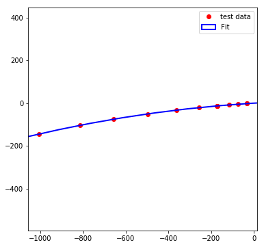

# least_square_fit_circle

find the best fitting circle

**input:** N points list x and list y

**output:** x-center, y-center, Radius, error

```python

#import the package
import lsfc

#create the data
x=[  -33.0889,   -32.1011,   -72.4388,  -115.8   ,  -170.532 ,
        -172.55  ,  -257.768 ,  -362.111 ,  -497.552 ,  -656.519 ,
        -814.409 , -1007.85  ]
y=[  -2.12004,   -2.05388,   -4.87116,   -8.18968,  -12.832  ,
        -13.0126 ,  -21.1943 ,  -32.7992 ,  -50.461  ,  -75.1209 ,
       -103.938  , -145.071  ]


# the package is also a class name
# create object, and then use the findit() function to get 
# xy, x-center and y-center
# R, the radius
# sigma, the fitting error

a=lsfc(x,y)
xy,R,sigma=a.findit()


# we can also use the compact way as
xy,R,sigma=lsfc(x,y).findit()

# we can plot the data as well
lsfc(x,y).showit()

```





